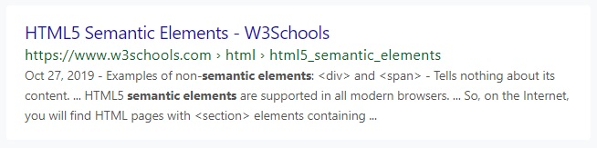
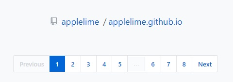
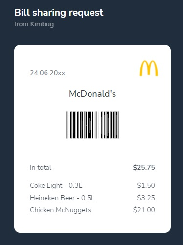
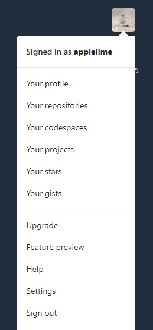
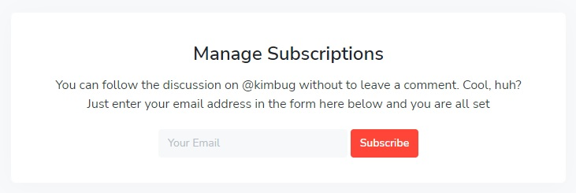
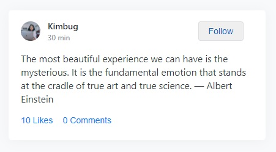
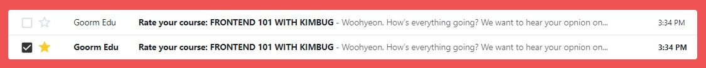
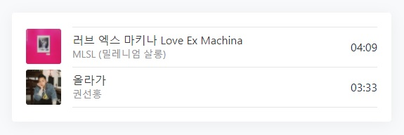

# HTML 연습 문서 정리

## 1. AD Banner  
  
**기본적인 광고 배너**  
-> h1, p, a 태그를 사용한 `기본적인 HTML 구조 작성 연습`

## 2. Google Search Result Item  
  
**구글 검색 결과 항목**  
-> `기본적인 구조 연습` 및 strong 태그, escape character 사용해보기

## 3. Feature Box  
  
**일반적인 소개 박스**  
-> `이미지가 정보로서 가치가 없을 경우`, image 태그를 사용하지 않고 `css로도 처리`할 수 있다.

## 4. Logo In Header (Navbar)  
  
**상단 메뉴바**  
-> 로고에도 페이지를 이동하는 기능이 들어가야 하므로 a 태그를 써야함.  
-> `눈에 보이는 것 말고도 동작하는 부분에 대해서도 생각`하여 구조를 짜야한다.

## 5. Breadcrumb & Pagination  
  
**브레드크럼 (현재 위치를 보여주는 기법) & 페이징**  
-> `aria-label 태그`를 사용하여 `스크린 리더로 읽힐 때 의미 전달`

## 6. Product Card  
  
**상품 카드**  
-> `폰트`를 이용하여 `아이콘 표시`  
-> css를 이용하여 위치를 바꿀 수도 있으니 `html은 구조에만 집중`!

## 7. Instagram User Profile  
  
**인스타그램 유저 프로필**  
-> post, followers, following 처럼 어떻게 보면 `key-value 구성인 경우 dl(정의 리스트)`로도 표현할 수 있다.

## 8. Receipt  
  
**영수증**  
-> `디테일` 살리기. L의 경우 aria-label로 litter로 읽히게 한다거나.  
-> total을 구조상 마지막에 위치시키고 css로 위치를 조정한다거나. `중요한건 html 구조!!`

## 9. Github Dropdown Menu  
  
**깃헙 드랍다운 메뉴**  
-> html `구조를 잡을 때는 완성본(펼쳐진 상태)을 기준`으로 만들어보자.  
-> 순서가 중요하지 않은 list라고 볼 수도 있고 `ul을 사용해서 표현`할 수도 있다.

## 10. Input Group  
  
**기본 Input태그 실습**  

## 11. Feed  
  
**사용자에게 정보를 제공하는 포맷**  
-> 이 때까지 배웠던 것들의 응용.  
-> 눈으로 보기에는 단순한 `글자일지라도 기능이 동작하니 버튼`으로 만든다는 생각

## 12. Gmail InBox  
  
**Gmail 받은편지함**  
-> 이 때까지 배웠던 것들의 응용2  
-> 같은 구조가 반복되므로 `table로 만든다는 접근`을 할 수 있다.

## 13. Music Player  
  
**음악 플레이어**  
-> audio 태그 사용해보기

## 14. Video Player  
  
**비디오 플레이어**  
-> video 태그 사용해보기