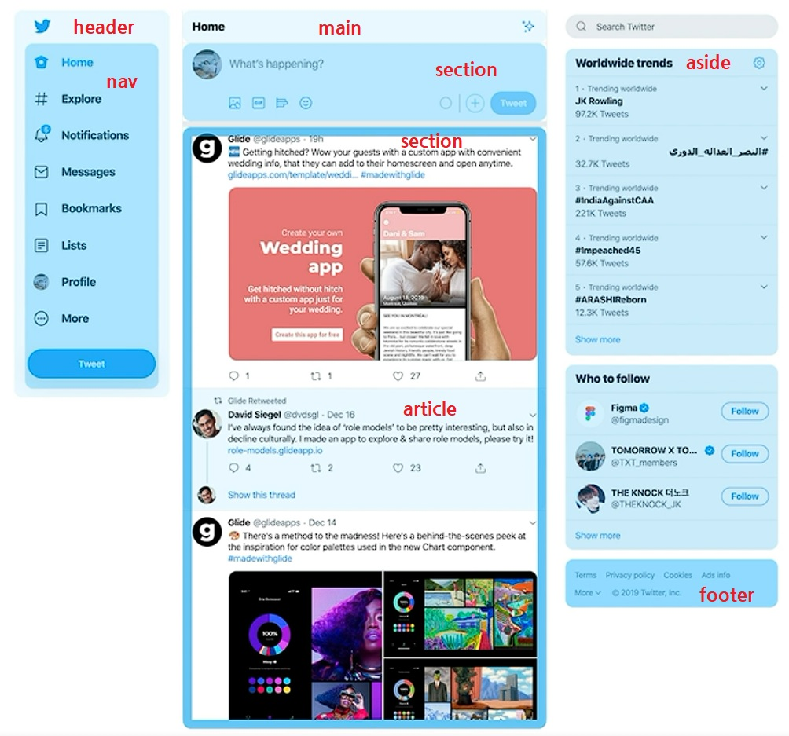

# HTML 마크업 실습
트위터 페이지 마크업하기  
아래 사진처럼 관련된 집합으로 섹션을 나누고 하나씩 마크업하여 전체 페이지를 만들었다.
  

### 1. header
보통 로고가 있거나 사이트명이 나타난 부분이 header일 확률이 높다.  
시작부분에 위치하고 사이트의 정체성을 나타내는 부분이므로 header를 사용하여 시작

### 2. Global Navigation
문서 간에 이동할 수 있는 요소가 있는 경우에 Navigation이라고 하며 nav 태그로 묶어 표시한다.

### 3. Main
메인은 페이지 본문에서 핵심되는 부분으로 문서에서 단 1개만 존재해야 함.

### 4. Tweet Form
트윗 입력 부분을 한 섹션으로 묶어 마크업하였다.  

이미지나 동영상 업로드 버튼의 경우 Input 태그(file type)로 구현하지만,  
Input 태그의 경우 스타일을 적용할 수 없어 따로 버튼을 만들었고, 자바스크립트로 기능 구현

280자 중 글자 입력 정도를 표시하는 부분도 strong 태그로만 마크업하고, css로 표현한다.

### 5. TimeLine
마찬가지로 한 섹션으로 묶어 주었고,  
시간순서대로 표시되어야 하므로 ol로 마크업하였다. (순서가 필요하다고 생각하여)

### 6. Tweet
하나의 정보 컨텐츠를 표현할 때 (블로그 글, 뉴스기사, 피드 등) 보통 article 태그로 섹션을 묶는다고 한다.  
이전 feed 및 dropdown 만들었던 것처럼 내용을 구성

### 7. Worldwide trends
본문 내용과 별개의 섹션은 aside 태그를 보통 사용한다. (광고 등..)  

### 8. footer
header와 마찬가지로 하단 사이트의 정보 표시 등은 footer를 이용한다.